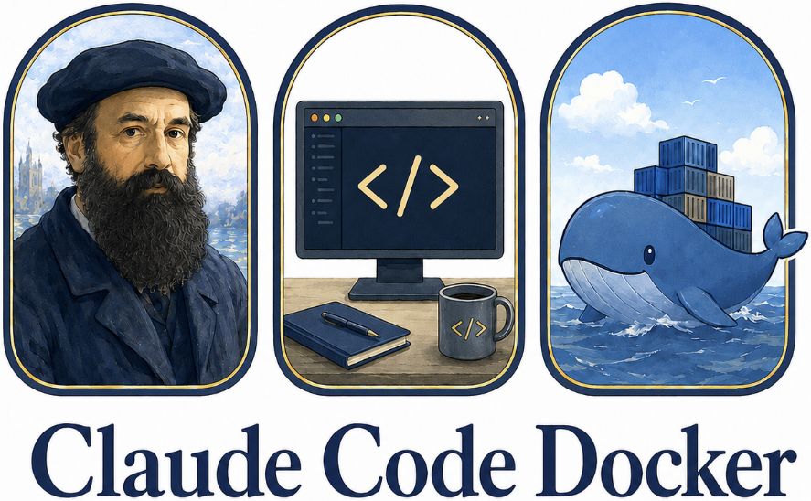

# Claude Code Docker

<p align="center">
  
</p>

**CCD** is a Python wrapper to build and run AI coding assistants inside a Docker container.

It builds a Docker image with one or more assistant CLIs and runs them against your local app folder.
Toolchains stay isolated while your project files remain local and editable.

Base image: Ubuntu 24.04 with Node.js, Python, and uv installed.

**Why?**

- Avoid installing assistant toolchains on your host.
- Keep a consistent, reproducible runtime across projects.
- Use separate app folders without cross-project conflicts.

## Similar Projects

- [Bubblewrap](https://github.com/containers/bubblewrap)
- [Docker Sandboxes](https://docs.docker.com/ai/sandboxes/)
- [NVIDIA OpenShell](https://github.com/NVIDIA/OpenShell)
- [claude-code-devcontainer](https://github.com/trailofbits/claude-code-devcontainer)
- [TencentCloud/CubeSandbox](https://github.com/TencentCloud/CubeSandbox)

## Quickstart

```bash
git clone git@github.com:sumkincpp/claude-code-docker.git
cd claude-code-docker
uv tool install . -e
ccd build
ccd run .
```

## Features (Build-Time)

Default build includes all clients and rust; you can include or exclude features.
Exclude `rust` with `--without rust` to keep the image smaller.

### CLI Clients

- `claude` - Anthropic Claude Code CLI
- `codex` - OpenAI Codex CLI
- `gemini` - Google Gemini CLI
- `opencode` - OpenCode CLI
- `copilot` - GitHub Copilot CLI
- `pi` - Pi Coding Agent CLI
- `jules` - Jules CLI (disabled by default)

### Runtimes

- `rust` - Rust toolchain via rustup

## Requirements

- Docker
- Python 3.12+
- uv (required for Quickstart and development)
- Host OS: Linux or macOS (Windows via WSL2).

## CLI Reference

### Build Image (ccd build)

```bash
ccd build [--with feature1,feature2,...] [--without feature3,feature4,...]
```

- `--with`: Comma-separated feature list to include (default: all features).
- `--without`: Comma-separated feature list to exclude.

Available build features:

- `rust`
- `claude`
- `codex`
- `gemini`
- `jules`
- `opencode`
- `copilot`
- `pi`

Examples:

```bash
ccd build --with rust,gemini
ccd build --without opencode,copilot
#
# building image without cache
ccd -vv build --no-cache
```

With that an image named `claude-code:latest` is built.

### Npm Install Policy

The Docker image resolves npm-distributed CLIs at build time through a release-age policy.
If a CLI version is left at `latest`, the build installs `package@latest` with npm's `--before <cutoff>` filter,
so npm picks the newest allowed top-level version and applies the same cutoff while resolving transitives.

Default:

```bash
NPM_CLI_MIN_RELEASE_AGE_DAYS=7
```

Examples:

```bash
ccd build --npm-min-release-age-days 14
ccd build --claude-version 2.1.117
ccd build --npm-min-release-age-days 0
ccd build --npm-audit-ignore-components pi
ccd build --npm-audit-force-fix-components pi
```

- CCD resolves and installs each npm CLI, then runs signature audit.
- npm audit failures fail the build.
- Use ignore or force-fix flags per component `--npm-audit-ignore-components`/`--npm-audit-force-fix-components` to ignore/force fix component
- Resolution metadata is saved under /metadata/

### Run Container (ccd run / ccd .)

```bash
ccd run [app_folder] [--home home_folder] [--memory MEM] [--cpus N] [-v|-vv|-vvv]
```

- `app_folder`: Local directory mounted to `/app` (default: `.`).
- `--home`: Local directory for assistant config (default: `$HOME/.claude-code-docker`).
- `--memory`: Memory limit (default: `1g`; overrides `ccd.toml`).
- `--cpus`: CPU limit (default: `2`; overrides `ccd.toml`).
- `-v/-vv/-vvv`: Verbosity levels (warning/info/debug/verbose-debug).
- Alias: `ccd .` is the same as `ccd run .`.

Resource defaults and extra volume mounts can be set in `ccd.toml` (see [Configuration](#configuration)).

Examples:

```bash
ccd run /path/to/app
ccd .
ccd run . --memory 8g --cpus 4
```

### Attach to Running Container (ccd attach)

If a container started with `ccd run` is already running, attach to it:

```bash
ccd attach
```

## Usage

### Authentication

On the first run, open a shell in the container and authenticate:

```bash
claude login
```

Other CLI login commands (available only if the client is installed; verify with each CLI's `--help` if needed):

- `codex login`
- `gemini auth login`
- `opencode auth login`
- `copilot auth login`
- `pi`

When CLI tools are run, they also inform you if authentication is needed.

## Local Claude: Using Claude Code with Ollama

The image includes `local-claude`, a wrapper that connects Claude Code to Ollama for local model execution.

Learn more about Ollama at [Claude Code with Anthropic API compatibility](https://ollama.com/blog/claude)

### Setup

Create a `.local-claude.env` file in your application directory:

```bash
# Ollama server URL
OLLAMA_BASE_URL=http://localhost:11434

# Default model (must support tools!)
OLLAMA_DEFAULT_MODEL=qwen2.5-coder:7b
```

Start CCD container and use `local-claude` to run Claude Code with Ollama.

The wrapper searches for config in:

1. `~/.local-claude.env`
2. Current directory `.local-claude.env`
3. `/app/.local-claude.env`

### Usage

List available models with tool support detection:

```bash
local-claude list
```

Run Claude Code with Ollama:

```bash
local-claude run                      # Use default model
local-claude run -m qwen2.5-coder:7b  # Use specific model
```

> Note: changing models with "/model <NAME>" is supported in claude-code CLI

The wrapper:

- Verifies Ollama connection
- Checks model availability
- Validates tool support via `/api/show` endpoint
- Sets required environment variables for local model usage
- Launches claude-code CLI

### Model Requirements

Models must support tool/function calling.

Ollama recommends the following models for use with Claude Code:

Local models -

- gpt-oss:20b
- qwen3-coder

Cloud models -

- glm-4.7:cloud
- minimax-m2.1:cloud

Use models with 32K+ context length for best results.

## Configuration

### ccd.toml

CCD reads configuration from `ccd.toml`. Two locations are checked and merged on every invocation:

| Location | Purpose |
|----------|---------|
| `~/.config/ccd/ccd.toml` | **Global** — user-wide defaults (mounts, resource limits) |
| `./ccd.toml` | **Local** — project-specific overrides (checked in alongside your code) |

**Merge rules:** local file wins for scalar values; mount lists from both files are combined (global mounts applied first).

#### `[build]` section

Controls `ccd build` behaviour.

```toml
[build]
# Features to include (mutually exclusive with without_features)
with_features = ["claude", "codex", "copilot", "rust"]
# without_features = ["jules", "opencode"]

# npm release-age policy (days a package must be published before it is accepted)
npm_min_release_age_days = 7
npm_min_release_age_ignore_components = []
npm_audit_ignore_components = []
npm_audit_force_fix_components = []

[versions]
# Pin individual tool versions (omit to use Dockerfile defaults)
# claude  = "latest"
# codex   = "latest"
# node    = "22"
# uv      = "0.7.2"
```

#### `[run]` section

Controls `ccd run` / `ccd .` behaviour.

```toml
[run]
# Resource limits (CLI flags --memory / --cpus override these)
memory = "4g"
cpus   = "4"

# Extra volume mounts appended to the built-in set.
# host supports ~ expansion; symlinks are resolved automatically.

[[run.mounts]]
host      = "~/.ssh"
container = "/home/ubuntu/.ssh"
readonly  = true
optional  = true   # silently skip if path is absent or a broken symlink

[[run.mounts]]
host      = "/datasets"
container = "/data"
# type    = "folder"   # "folder" (default) or "file"
```

Recommended global config (`~/.config/ccd/ccd.toml`) to mount common host credentials and caches into every container:

```toml
[run]

[[run.mounts]]
host      = "~/.gitconfig"
container = "/home/ubuntu/.gitconfig"
type      = "file"
optional  = true

[[run.mounts]]
host      = "~/.config/git"
container = "/home/ubuntu/.config/git"
optional  = true

[[run.mounts]]
host      = "~/.ssh"
container = "/home/ubuntu/.ssh"
readonly  = true
optional  = true

[[run.mounts]]
host      = "~/.local/share/uv"
container = "/home/ubuntu/.local/share/uv"
optional  = true
```

### Volume Mounts

The following host paths are always mounted into the container:

- `{app_folder}` → `/app` (container working directory)
- `{home_folder}/.claude` → `/home/ubuntu/.claude`
- `{home_folder}/.claude.json` → `/home/ubuntu/.claude.json`
- `{home_folder}/.gemini` → `/home/ubuntu/.gemini`
- `{home_folder}/.codex` → `/home/ubuntu/.codex`
- `{home_folder}/.copilot` → `/home/ubuntu/.copilot`
- `{home_folder}/.pi` → `/home/ubuntu/.pi`

Additional mounts can be added via `[[run.mounts]]` in `ccd.toml` (see above).

The `--home` directory is expected to contain the assistant config folders shown above.

### Init File

On container start, the entrypoint sets defaults and optionally sources an init file:

- Default variables: `UV_PROJECT_ENVIRONMENT=/app/.venv2`, `CCD_APP_DIR=/app`.
- Init file resolution order: `$CCD_INIT_FILE` (if set), `/app/.ccd_env`, `/app/.ccd-init.sh`.
- If present, the init file is sourced, and you can override defaults there.

Example init file:

```bash
export UV_PROJECT_ENVIRONMENT=/app/.venv
export CCD_APP_DIR=/app
```

## Development

```bash
git clone git@github.com:sumkincpp/claude-code-docker.git
cd claude-code-docker
uv run ccd --help
```

## FAQ

- Q: Where do credentials live on the host?
- A: Under the `--home` directory (default: `$HOME/.claude-code-docker`), mounted into `/home/ubuntu`.

- Q: Can I use a custom container name?
- A: The name is auto-generated based on the app folder name as `ccd-{folder_name}`. You can attach via `ccd attach` without knowing it.
